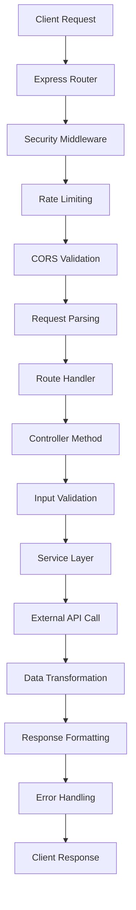

# DeFi Data API - Architecture Documentation

## 🏗️ System Architecture

### High-Level Overview
```
┌─────────────────┐    ┌─────────────────┐    ┌─────────────────┐
│   Client Apps   │    │   API Gateway   │    │ External APIs   │
│                 │    │                 │    │                 │
│ • Web Frontend  │◄──►│ • Rate Limiting │◄──►│ • Bifrost API   │
│ • Mobile Apps   │    │ • CORS          │    │ • Chain Data    │
│ • Third Party   │    │ • Auth          │    │ • Price Feeds   │
└─────────────────┘    └─────────────────┘    └─────────────────┘
                                │
                                ▼
                       ┌─────────────────┐
                       │   Express.js    │
                       │   Application   │
                       │                 │
                       │ • Middleware    │
                       │ • Routing       │
                       │ • Error Handler │
                       └─────────────────┘
                                │
                  ┌─────────────┼─────────────┐
                  │             │             │
                  ▼             ▼             ▼
        ┌─────────────┐ ┌─────────────┐ ┌─────────────┐
        │Controllers  │ │ Services    │ │ Middleware  │
        │             │ │             │ │             │
        │• Validation │ │• API Calls  │ │• Security   │
        │• Response   │ │• Transform  │ │• Logging    │
        │• Error Mgmt │ │• Cache      │ │• Validation │
        └─────────────┘ └─────────────┘ └─────────────┘
```

## 📁 Project Structure Analysis

### Core Application Layers

#### 1. **Presentation Layer** (`/routes`)
```typescript
src/routes/
├── v1/
│   ├── index.ts          // Route aggregation and versioning
│   ├── bifrost.ts        // Bifrost protocol endpoints
│   └── stablecoin.ts     // Legacy stablecoin endpoints
```

**Responsibilities**:
- HTTP request routing and method handling
- OpenAPI/Swagger documentation definitions
- Route-level middleware application
- Request parameter extraction

#### 2. **Business Logic Layer** (`/controllers`)
```typescript
src/controllers/
├── bifrostController.ts   // Main Bifrost protocol logic
└── stablecoinController.ts // Legacy stablecoin operations
```

**Responsibilities**:
- Request validation and sanitization
- Business rule enforcement
- Response formatting and pagination
- Error handling and logging

#### 3. **Service Layer** (`/services`)
```typescript
src/services/
├── bifrostService.ts     // External API integration
└── stablecoinService.ts  // Legacy service operations
```

**Responsibilities**:
- External API communication
- Data transformation and normalization
- Caching strategies
- Protocol-specific business logic

#### 4. **Infrastructure Layer** (`/middleware`, `/config`, `/utils`)
```typescript
src/
├── middleware/
│   ├── errorHandler.ts       // Centralized error management
│   ├── rateLimiter.ts        // API abuse prevention
│   ├── requestValidator.ts   // Input validation
│   └── securityHeaders.ts    // Security hardening
├── config/
│   ├── index.ts              // Environment configuration
│   └── swagger.config.ts     // API documentation spec
└── utils/
    ├── logger.ts             // Structured logging
    └── inputValidator.ts     // Validation utilities
```

## 🔄 Request Flow Architecture

### Typical Request Lifecycle



### Security Middleware Chain

1. **Helmet Security Headers**
   - Content Security Policy (CSP)
   - HTTP Strict Transport Security (HSTS)
   - X-Frame-Options protection

2. **CORS Configuration**
   - Origin validation
   - Credential handling
   - Preflight request support

3. **Rate Limiting**
   - IP-based request throttling
   - Burst protection
   - Attack mitigation

4. **Input Validation**
   - Multi-layer parameter validation
   - Type checking and sanitization
   - Bounds checking and range validation

## 🎯 Design Patterns

### 1. **MVC (Model-View-Controller)**
- **Model**: TypeScript interfaces and types (`/types`)
- **View**: JSON API responses with standardized format
- **Controller**: Request handling and business logic orchestration

### 2. **Service Layer Pattern**
```typescript
// Controller -> Service -> External API
Controller.getYields()
  -> bifrostService.getSiteData()
    -> External Bifrost API
  -> Transform and validate data
  -> Return standardized response
```

### 3. **Middleware Chain Pattern**
```typescript
app.use(helmet())           // Security headers
app.use(cors())             // Cross-origin handling  
app.use(compression())      // Response compression
app.use(morgan())           // Request logging
app.use(express.json())     // Body parsing
app.use('/api/v1', routes)  // API routes
app.use(errorHandler)       // Error handling
```

### 4. **Repository Pattern** (Implicit)
- Services act as repositories for external data
- Data transformation and caching abstraction
- Protocol-specific data access patterns

## 🔒 Security Architecture

### Multi-Layer Security Model

#### Layer 1: Network Security
- **Rate Limiting**: 100 requests/15min per IP
- **CORS**: Cross-origin request validation
- **Helmet**: Security headers and CSP

#### Layer 2: Input Security  
- **Parameter Validation**: Type, format, range checking
- **Sanitization**: Special character removal
- **Length Limits**: DoS attack prevention

#### Layer 3: Business Logic Security
- **Token Validation**: 11-layer token pair validation
- **Bounds Checking**: Numeric parameter limits
- **Support List Validation**: Official protocol token verification

#### Layer 4: Response Security
- **Error Sanitization**: No sensitive data exposure
- **Structured Logging**: Security event monitoring
- **Response Headers**: Additional security headers

## 📊 Data Flow Architecture

### External Data Integration

```typescript
// Bifrost Protocol Data Flow
External APIs → Service Layer → Controller → Client
     │              │             │           │
     │              │             │           │
Bifrost API ────→ Transform ───→ Validate ──→ JSON
Chain Data       Normalize     Format       Response
Price Feeds      Cache         Paginate     Headers
```

### Data Transformation Pipeline

1. **Raw Data Ingestion**
   - External API responses
   - Protocol-specific formats
   - Real-time rate updates

2. **Normalization Layer**
   - Standard interface mapping
   - Unit conversion and precision
   - Missing data handling

3. **Validation Layer**
   - Data integrity checks
   - Business rule validation
   - Error detection and reporting

4. **Response Formatting**
   - Standardized API response structure
   - Pagination metadata
   - Timestamp and versioning

## 🚀 Performance Architecture

### Optimization Strategies

#### 1. **Response Optimization**
- **Compression**: Gzip/deflate response compression
- **Pagination**: Configurable result limits (1-100)
- **Field Selection**: Minimal data transfer

#### 2. **Caching Strategy**
- **Service-Level Caching**: External API response caching
- **TTL Management**: Time-based cache invalidation
- **Smart Cache Keys**: Parameter-based cache segmentation

#### 3. **Request Optimization**
- **Parallel Processing**: Non-blocking async operations
- **Connection Pooling**: HTTP client optimization
- **Batch Operations**: Multiple token processing

## 🔧 Configuration Architecture

### Environment-Based Configuration

```typescript
// Configuration Hierarchy
.env → config/index.ts → Application Components
  │         │                    │
  │         │                    │
Secrets   Validation         Runtime Config
Runtime   Defaults           Feature Flags
Overrides Type Safety        Service URLs
```

### Development vs Production

#### Development Configuration
- Detailed logging (Morgan 'dev' format)
- CORS enabled for all origins
- Hot reload with Nodemon
- Source maps for debugging

#### Production Configuration
- Structured logging (Morgan 'combined')
- Restricted CORS origins
- Optimized build output
- Security hardening

## 📈 Monitoring & Observability

### Logging Architecture

```typescript
// Structured Logging Pipeline
Request → Morgan → Custom Logger → Console/File
   │         │           │            │
   │         │           │            │
HTTP     Middleware   Application   Storage
Logs     Logging      Events        System
```

### Metrics Collection

- **Request Metrics**: Response times, status codes
- **Business Metrics**: Token conversion rates, API usage
- **Security Metrics**: Rate limit hits, validation failures
- **Performance Metrics**: Memory usage, CPU utilization

## 🔄 API Versioning Strategy

### URL-Based Versioning
```
/api/v1/bifrost/*     - Current stable version
/api/v1/stablecoins/* - Legacy endpoints
```

### Backward Compatibility
- Legacy endpoint preservation
- Graceful deprecation strategy
- Version-specific documentation

## 🧪 Testing Architecture

### Testing Pyramid Structure
```
                    ┌─────────────┐
                    │     E2E     │  ← Full API integration
                    │   Testing   │
               ┌────┴─────────────┴────┐
               │   Integration Tests   │  ← Controller + Service
               │                       │
          ┌────┴───────────────────────┴────┐
          │         Unit Tests              │  ← Individual functions
          │                                 │
          └─────────────────────────────────┘
```

### Test Categories
- **Unit Tests**: Individual function validation
- **Integration Tests**: Service integration testing
- **API Tests**: Endpoint behavior validation
- **Performance Tests**: Load and stress testing

---

## 🔮 Future Architecture Considerations

### Scalability Enhancements
- **Microservices**: Service decomposition strategy
- **Database Integration**: Persistent data storage
- **Message Queues**: Async processing capabilities
- **Load Balancing**: Multi-instance deployment

### Security Enhancements
- **API Key Authentication**: Client identification
- **JWT Token Management**: Stateless authentication
- **Audit Logging**: Security event tracking
- **Encryption**: Data protection at rest/transit

### Performance Enhancements
- **Redis Caching**: Distributed cache layer
- **Database Optimization**: Query performance tuning
- **CDN Integration**: Static asset optimization
- **Monitoring Integration**: APM and metrics collection